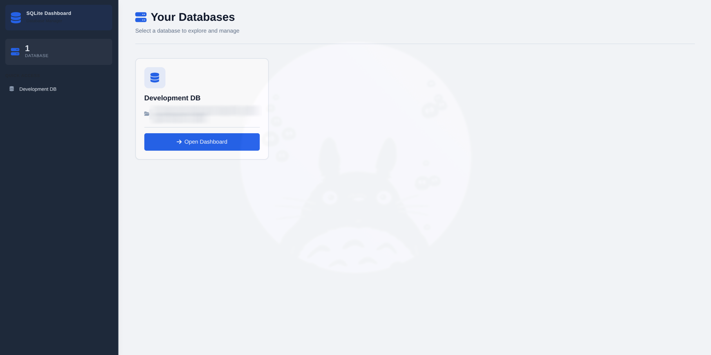
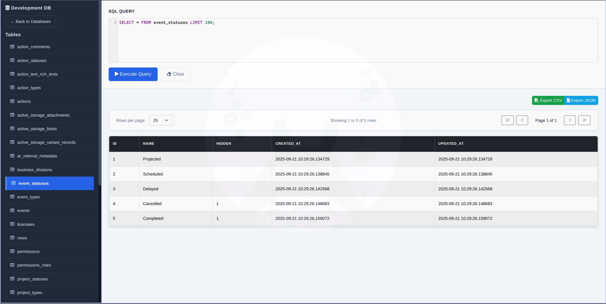

# SQLite Dashboard

[](https://badge.fury.io/rb/sqlite_dashboard)
[](https://opensource.org/licenses/MIT)

A beautiful, feature-rich SQLite database browser and query interface for Rails applications. Mount it as an engine in your Rails app to inspect and query your SQLite databases through a clean, modern interface.

## Screenshots

### Database Selection


### Query Interface & Results


## Features

- 🎨 **Modern UI** with dark sidebar theme and responsive design
- 🔍 **Multiple Database Support** - Configure and switch between multiple SQLite databases
- 🗄️ **Auto-Detection** - Automatically discovers SQLite databases from `config/database.yml`
- ✨ **SQL Syntax Highlighting** - CodeMirror editor with SQL syntax highlighting and autocomplete
- 📊 **Interactive Query Results** - Client-side pagination with customizable rows per page
- 💾 **Export Functionality** - Export results to CSV or JSON with custom formatting options
- 🎯 **Quick Table Browse** - Click any table name to instantly query it
- ⚡ **Fast & Lightweight** - No build tools required, works with Rails importmap
- 🔒 **Read-Only Mode** - Prevents accidental data modification (configurable)
- 🚫 **Security Controls** - DROP and ALTER operations always forbidden
- ⌨️ **Keyboard Shortcuts** - `Ctrl/Cmd + Enter` to execute queries
- 📱 **Fully Responsive** - Works beautifully on desktop and mobile devices

## Installation

Add this line to your application's Gemfile:

```ruby
gem 'sqlite_dashboard'
```

And then execute:

```bash
bundle install
```

## Quick Start (Recommended)

The easiest way to install SQLite Dashboard is using the built-in generator:

```bash
rails generate sqlite_dashboard:install
```

This will:
- ✅ Create an initializer at `config/initializers/sqlite_dashboard.rb`
- ✅ Mount the engine in your routes at `/sqlite_dashboard`
- ✅ Auto-detect your SQLite databases
- ✅ Display helpful setup instructions

Then start your Rails server and visit:

```
http://localhost:3000/sqlite_dashboard
```

## Manual Configuration

If you prefer to set up manually:

### Step 1: Mount the Engine

In your `config/routes.rb`:

```ruby
Rails.application.routes.draw do
  mount SqliteDashboard::Engine => "/sqlite_dashboard"

  # Your other routes...
end
```

### Step 2: Configure Databases

Create an initializer `config/initializers/sqlite_dashboard.rb`:

```ruby
SqliteDashboard.configure do |config|
  # Option 1: Explicitly define databases
  config.db_files = [
    {
      name: "Development",
      path: Rails.root.join("db", "development.sqlite3").to_s
    },
    {
      name: "Test",
      path: Rails.root.join("db", "test.sqlite3").to_s
    }
  ]

  # Option 2: Or leave empty to auto-detect from database.yml
  # (Automatically loads SQLite databases for current environment)

  # Security: Control write operations (default: false)
  config.allow_dml = false  # Read-only mode
end
```

### Step 3: Access the Dashboard

Start your Rails server and navigate to:

```
http://localhost:3000/sqlite_dashboard
```

## Usage

### Basic Query Execution

1. Select a database from the main page
2. Write your SQL query in the syntax-highlighted editor
3. Press `Execute Query` or use `Ctrl/Cmd + Enter`
4. View paginated results below

### Quick Table Browse

- Click any table name in the left sidebar to instantly query it
- Tables are automatically limited to 100 rows for performance

### Pagination Controls

- Adjust rows per page (10, 25, 50, 100, 500)
- Navigate through pages with First, Previous, Next, Last buttons
- See current position (e.g., "Showing 1 to 25 of 150 rows")
- Client-side pagination for instant navigation

### Export Query Results

**CSV Export:**
- Choose separator: comma, semicolon, tab, or pipe
- Option to include/exclude headers as first row
- Exports all query results (not just paginated view)

**JSON Export:**
- Two format options:
  - Array of objects: `[{"col1": "val1", "col2": "val2"}, ...]`
  - Object with columns & rows: `{"columns": [...], "rows": [...]}`
- Pretty print option for formatted/readable JSON
- Timestamped filenames for easy organization

### Keyboard Shortcuts

- `Ctrl/Cmd + Enter` - Execute current query
- `Ctrl + Space` - Trigger SQL autocomplete
- `Escape` - Close autocomplete suggestions

## Security Considerations

⚠️ **Warning**: This gem provides direct SQL access to your databases.

### Built-in Security Features

1. **Read-Only Mode by Default** - DML operations are disabled by default:

```ruby
# config/initializers/sqlite_dashboard.rb
SqliteDashboard.configure do |config|
  config.allow_dml = false  # Default: prevents INSERT, UPDATE, DELETE, CREATE, TRUNCATE
end
```

2. **Always Forbidden Operations** - DROP and ALTER are always blocked, even when `allow_dml = true`:

```ruby
# These are NEVER allowed for safety:
# - DROP TABLE/INDEX/VIEW
# - ALTER TABLE
```

### Recommended Security Measures

1. **Development Only** - Only mount in development environment:

```ruby
# config/routes.rb
if Rails.env.development?
  mount SqliteDashboard::Engine => "/sqlite_dashboard"
end
```

2. **Authentication with Devise** - Add authentication for production use:

```ruby
# config/routes.rb
authenticate :user, ->(user) { user.admin? } do
  mount SqliteDashboard::Engine => "/sqlite_dashboard"
end
```

3. **HTTP Basic Auth** - Quick protection with HTTP Basic Auth:

```ruby
# config/initializers/sqlite_dashboard.rb or config/application.rb
SqliteDashboard::Engine.middleware.use Rack::Auth::Basic do |username, password|
  ActiveSupport::SecurityUtils.secure_compare(username, ENV['DASHBOARD_USER']) &
  ActiveSupport::SecurityUtils.secure_compare(password, ENV['DASHBOARD_PASS'])
end
```

4. **Enable DML Only When Needed** - Only allow write operations in trusted environments:

```ruby
SqliteDashboard.configure do |config|
  # Use environment variables or Rails.env checks
  config.allow_dml = Rails.env.development? || Rails.env.test?
end
```

## Customization

### Custom Styling

Override styles by creating `app/assets/stylesheets/sqlite_dashboard_overrides.css`:

```css
.sqlite-dashboard-container {
  /* Your custom styles */
}

.CodeMirror {
  /* Customize editor appearance */
  font-family: 'Fira Code', monospace;
  font-size: 14px;
}
```

### Configuration Options

The `SqliteDashboard.configure` block accepts the following configuration options:

#### `db_files`

**Type:** `Array<Hash>`
**Default:** `[]` (automatically loads from `config/database.yml` if empty)
**Required:** No

Specifies the SQLite database files to make available in the dashboard. Each database should be defined as a hash with `:name` and `:path` keys.

```ruby
SqliteDashboard.configure do |config|
  config.db_files = [
    {
      name: "Development Database",
      path: Rails.root.join("storage", "development.sqlite3").to_s
    },
    {
      name: "Cache Database",
      path: Rails.root.join("storage", "cache.sqlite3").to_s
    },
    {
      name: "Custom Database",
      path: "/absolute/path/to/database.sqlite3"
    }
  ]
end
```

**Automatic Database Discovery:**
If `db_files` is empty (default), the gem will automatically discover SQLite databases from your `config/database.yml` file for the current Rails environment. This works for both single and multiple database configurations (Rails 6+).

#### `add_database` Helper Method

**Type:** `Method`
**Parameters:** `name` (String), `path` (String)

A convenience method to add databases one at a time instead of assigning the entire array:

```ruby
SqliteDashboard.configure do |config|
  config.add_database("Development", Rails.root.join("db/development.sqlite3").to_s)
  config.add_database("Test", Rails.root.join("db/test.sqlite3").to_s)
  config.add_database("Analytics", "/var/data/analytics.sqlite3")
end
```

#### `allow_dml`

**Type:** `Boolean`
**Default:** `false`
**Recommended:** `false` (read-only)

Controls whether Data Manipulation Language (DML) statements are allowed. When `false`, only SELECT queries are permitted, preventing accidental data modification.

```ruby
SqliteDashboard.configure do |config|
  # Read-only mode (recommended for production-like environments)
  config.allow_dml = false

  # Or allow write operations (USE WITH CAUTION)
  # config.allow_dml = true

  config.db_files = [
    { name: "My Database", path: "db/production.sqlite3" }
  ]
end
```

**⚠️ Security Warning:** Enabling `allow_dml = true` permits INSERT, UPDATE, DELETE, and other write operations. Only enable this in trusted, development-only environments.

### Complete Configuration Example

```ruby
# config/initializers/sqlite_dashboard.rb
SqliteDashboard.configure do |config|
  # Option 1: Explicitly define databases
  config.db_files = [
    {
      name: "Primary Database",
      path: Rails.root.join("storage", "development.sqlite3").to_s
    },
    {
      name: "Background Jobs",
      path: Rails.root.join("storage", "jobs.sqlite3").to_s
    }
  ]

  # Option 2: Or use the helper method
  # config.add_database("Development", Rails.root.join("db/development.sqlite3").to_s)
  # config.add_database("Test", Rails.root.join("db/test.sqlite3").to_s)

  # Option 3: Or leave empty to auto-discover from database.yml
  # config.db_files = [] # (default)

  # Security: Disable write operations (recommended)
  config.allow_dml = false
end
```

### Environment-Specific Configuration

You can conditionally configure databases based on the Rails environment:

```ruby
SqliteDashboard.configure do |config|
  case Rails.env
  when 'development'
    config.db_files = [
      { name: "Dev DB", path: Rails.root.join("storage/development.sqlite3").to_s },
      { name: "Test DB", path: Rails.root.join("storage/test.sqlite3").to_s }
    ]
    config.allow_dml = true  # Allow writes in development

  when 'staging'
    config.db_files = [
      { name: "Staging DB (Read-Only)", path: Rails.root.join("db/staging.sqlite3").to_s }
    ]
    config.allow_dml = false  # Read-only in staging

  when 'production'
    # Generally not recommended to use in production
    # But if you must, make it read-only
    config.db_files = [
      { name: "Production DB", path: Rails.root.join("db/production.sqlite3").to_s }
    ]
    config.allow_dml = false
  end
end
```

## Development

After checking out the repo, run `bin/setup` to install dependencies. Then, run `rake test` to run the tests.

To install this gem onto your local machine, run:

```bash
bundle exec rake install
```

To release a new version:

1. Update the version number in `version.rb`
2. Update the CHANGELOG.md
3. Run `bundle exec rake release`

## Contributing

Bug reports and pull requests are welcome on GitHub at https://github.com/yourusername/sqlite_dashboard. This project is intended to be a safe, welcoming space for collaboration.

### Development Setup

1. Fork the repository
2. Create your feature branch (`git checkout -b feature/amazing-feature`)
3. Commit your changes (`git commit -m 'Add amazing feature'`)
4. Push to the branch (`git push origin feature/amazing-feature`)
5. Open a Pull Request


## Roadmap

### Completed ✅
- [x] **v1.0** - Core SQLite browser with modern UI
- [x] **v1.0** - SQL syntax highlighting with CodeMirror
- [x] **v1.0** - Client-side pagination
- [x] **v1.0** - Auto-detection from database.yml
- [x] **v1.0** - CSV & JSON export with options
- [x] **v1.0** - Read-only mode with DML controls
- [x] **v1.0** - Dark sidebar theme
- [x] **v1.0** - Rails generator for easy installation

### Planned 🚀
- [ ] **v1.1** - Query history and saved queries
- [ ] **v1.2** - Database schema visualization
- [ ] **v1.3** - Table relationships diagram
- [ ] **v1.4** - Query performance analytics
- [ ] **v2.0** - Multi-query execution
- [ ] **v2.1** - Full dark mode theme toggle
- [ ] **v2.2** - SQL query builder UI

## License

The gem is available as open source under the terms of the [MIT License](https://opensource.org/licenses/MIT).

## Credits

Created by [Giovanni Panasiti](https://github.com/giovapanasiti)

Special thanks to:
- [CodeMirror](https://codemirror.net/) for the SQL editor
- [Bootstrap](https://getbootstrap.com/) for the UI framework
- [Font Awesome](https://fontawesome.com/) for icons

## Support

- 📧 [Email support](mailto:giova.panasiti@hey.com)

---

Made with ❤️ for the Rails community